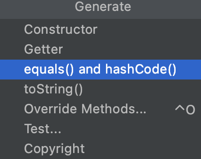

# Item 11: equals를 재정의하려거든 hashCode도 재정의하라

## 요약

- IntelliJ 에서 Cmd + N 을 누르면 나오는 Generate 기능을 애용하자. 알아서 equals 와 hashCode를 재정의해준다.
- 절대로! Never! hashCode 와 equals 를 직접 구현하려고 하지마라. 고생만하다가 욕을 엄청 먹는다.
- IDE 의 자동 Generate 이 아니라, 직접 커스텀으로 구현해야할 경우에는, 자바 코드가 아니라 DB 쿼리로 해결할 수 있는 문제일 수도 있으니 DBA에게 커피를 사주러 다녀오자.

- 그럼 대체 Item 11 은 왜 공부해야하는가? 개발할 때 활용하는 경우는 별로 없고, 면접용으로 물어보곤 한다.

## 재정의 해야하는 이유 (면접용)

- 공식 문서에서 그렇게 하라고 시켜서
- [Java 11 오라클 문서](https://docs.oracle.com/en/java/javase/11/docs/api/java.base/java/lang/Object.html#hashCode())

> If two objects are equal according to the equals(Object) method, then calling the hashCode method on each of the two objects must produce the same integer result.

- 공식 문서를 읽어본적 있다고 말하면, 보통 더 물어보지는 않더라

## 재정의 해야하는 이유 (기술적인 이유)

- 자바의 해시 테이블이 **Separate Chaining** 방식으로 구현되어 있기 때문에
- 파이썬은 해시 테이블이 **Open Addressing** 방식으로 구현되어 있기에 해당되지 않는다.
    - 따라서 자바의 HashMap과 비슷한 Dictionary 라는 자료구조가 있음에도, 재정의가 정상적인 컨벤션이 아니다.
    - [Python 에서는 hash 와 eq 를 재정의하지 마라](https://eng.lyft.com/hashing-and-equality-in-python-2ea8c738fb9d)
- 진짜 변태같은 면접관은 여기까지 물어보는 경우도 있다.

## Separate Chaining 을 직접 구현하다 보면 알게되는 점

- 자바 객체는 Hash Value 를 통해 검색되고, Reference 를 통해 식별된다.
    - Reference 가 DB 의 PK 라면, Hash Value 는 인덱싱과 비슷하다. (실제로 인덱싱을 할 때 선택된 attribute 들을 가지고 해싱 과정이 들어간다.)
        - 예시가 적절한지 K 교수님의 피드백이 필요
- equals 가 같음에도, hash value 가 다르면 검색이 불가능하다.
- equals 는 equivalence relation 이지만, hashCode 값의 비교는 equivalence relation 에 해당되지 않는다.

## 개인적인 경험담

- VO(Value Object) 에 대해서만 equals 와 hashCode 를 재정의하는게 좋더라
- POJO는 멤버가 같더라도, 생명주기가 다르면 전혀 다른 객체로 다루도록 구현해야 버그 추적이나 성능 최적화가 더 쉽다. (같은 객체로 인식하면 누가 문제를 일으킨건지, 누구 때문에 성능이 떨어지는지 명확하게 blame 하기 어렵다)
- 비유: 어제의 자신과, 지금의 자신과, 내일의 자신은 모두 다른 사람이다.

## 참고

- [Baeldung](https://www.baeldung.com/java-hashcode)
- [IDE 별로 자동 생성해주는 hashCode 비교해보기](https://github.com/eugenp/tutorials/tree/master/core-java-modules/core-java-lang-oop-methods/src/main/java/com/baeldung/hashcode)
