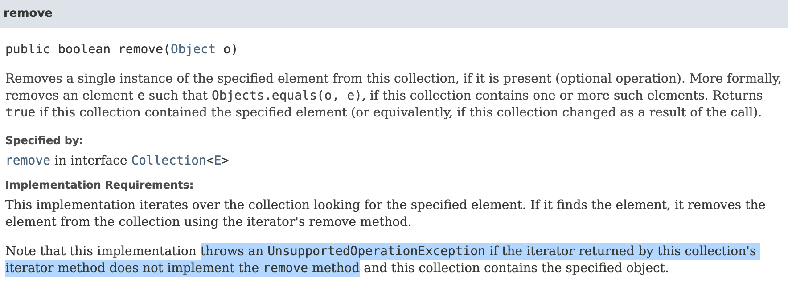
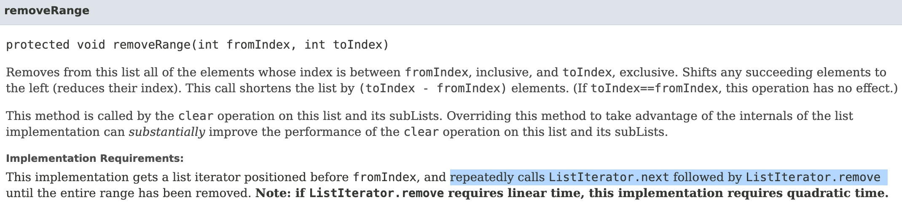

# Item19: 상속을 고려해 설계하고 문서화하라. 그러지 않았다면 상속을 금지하라.

## 핵심

- 클래스를 final 로 선언하거나, 생성자를 private 으로 해서 상속을 금지한다.
- 상속을 허용한다면, 어떻게 상속해야하는지 자세한 문서를 제공해야한다.

## 요약

- 왜 상속을 금지하는지 설명하고, 상속을 허용하고 싶을 경우 문서를 어떻게 작성해야하는지 안내한다.
- 굳이 고생하지 말고, 클래스 앞에 final 을 붙여서 상속을 하지 말자...
- 상속을 하지 말아야 할 이유: override 때문이다.
    - 상속후 기존 메서드를 override 하면 온갖 기상천외한 버그를 만들 수 있다. 해킹을 하고 싶다면 해보자.
- 개인 경험담: 상속하지 않으면 외부 모듈 탓을 할 수 있는데, 상속을 하면 개발자 본인 책임이 된다.
    - 다만 프레임워크가 너무 거지같은 경우 상속을 받아서 직접 구현하거나 최적화를 해야하는데, 그럴 경우는 차라리 프레임워크를 바꿀수는 없을 지 진지하게 고민하자.

##  책 내용 정리

- 상속용 클래스는 **재정의(override)**할 수 있는 메서드를 내부적으로 **어떻게** 이용하는지 문서로 남겨야한다.
- 문서를 만들 때는 `@implSpec` 태그를 붙여주면 javaDoc 이 자동으로 문서를 생성해준다.
- 이런 문서화가 이미 망한 문서인 이유는, 제대로 캡슐화되어 있다면 객체 내부의 동작과정을 알 필요가 없어야 하고, 알 방법도 없어야 하기 때문이다.
- 메서드가 내부적으로 **어떻게** 이용하고 있는지 서술하는 것은, 캡슐화를 깨부수고 내부 동작과정을 설명한다는 것을 뜻한다.
- 이런 문서는 작성하는 것도 읽는 것도 매우 괴롭고 짜증을 불러 일으킨다.
- 그러니깐 책에 나온대로 `상속용으로 설계하지 않은 클래스는 상속을 금지`하자
- 개인적으로 기존 클래스의 기능을 확장하기 위해 개인적으로 추천하는 방법은 **Wrapper** 를 만드는 것이다.
    - Wrapper Class 도 좋고, Wrapper Method 도 좋다. 기존 코드가 덮어씌워지는 일이 최대한 없도록 하자.

## 상속 클래스에 관한 문서 예시

#### [AbstractCollection.remove() 메서드](https://docs.oracle.com/en/java/javase/11/docs/api/java.base/java/util/AbstractCollection.html)



iterator() 메서드가 반환하는 iterator 객체에 remove() 메서드가 구현되어 있지 않으면 망한다고 한다.

언제 UnsupportedOperationException 가 발생하는지에 대한 내부 동작과정을 설명하고 있다.

#### [AbstractList.removeRange() 메서드](https://docs.oracle.com/en/java/javase/11/docs/api/java.base/java/util/AbstractList.html)



파란색으로 줄친 부분에서 removeRange 가 어떻게 동작하는지 설명하고 있다. 캡슐화가 망했다.

다만 이 메서드는 유용한데, 이 메서드가 없으면 sublist 에서 remove 를 할 때 빅오가 O(n^2) 이 될것이기 떄문이다.

따라서 O(n) 시간에 remove 를 할 수 있는 removeRange 는 유용하다.

이런식으로 내부 동작 과정에 끼어들 수 있는 메서드를 **훅(hook)** 이라고 한다.

## 상속 클래스에서 어떤 메서드를 override 가능하게 허용해야하는가?

- 차라리 허용하지 말아야할 경우에 대한 이야기가 더 많아보인다.
- 조슈아 블로크는 `심사숙고해서 잘 예측`해보라는 황당한 소리를 힌다.
  - 심사숙고할 수 있는 방법이 직접 하위클래스를 만들어보는 것이 유일하기 떄문이다.
  - 하위 클래스가 한 두개면 상관없지만, 막상 허용하기 시작하면 레거시가 쌓여나가기 시작할 것이다.
  - 그 모든 하위 클래스를 매번 다 검증하려면, 너무나 공포스러운 야근이 기다리고 있다.

## 생성자에서는 override 가능한 메서드를 호출하지 말자.

- 매우 중요한 규칙 같다. 그보다 생성자에서는 로직 자체가 없었으면 한다.
- 오동작을 일으키는 예시는 다음과 같다.

```Super.java
public class Super {
    public Super() {
        overrideMe();
    }
    public void overrideMe() {}
}
```

```Sub.java
import java.time.Instant;

public class Sub extends Super {
    private final Instant instant;

    public Sub() {
        this.instant = Instant.now();
    }

    public void overrideMe() {
        System.out.println(instant);
    }

    public static void main(final String[] args) {
        final Sub sub = new Sub();
        sub.overrideMe();
    }
}
```

instant 가 2번 출력되기를 기대하지만, 상위 클래스의 생성자가 실행시에 instant 가 생성되어 있지 않아서, null 이 발생한다.

지금은 웃고 넘길일이지만, 현업에서는 어디서 NullPointerException 이 왜 발생했는지 추적하기 매우 어려울 것 같다.

## Cloneable 과 Serializable

Cloneable 과 Serializable 의 clone() 과 readObject() 는 절대로 재정의 가능 메서드를 호출하지 말라고 한다.

하지만 이펙티브 자바의 입장은 Cloneable 클래스와 Serializabe 을 아예 사용하지 말라는 입장이다.

Cloneable 은 Item13 에서 얼마나 끔찍한지 설명하고 있고,

Serializable 은 12장에서, item 이 아니라 장 하나에 걸쳐서 왜 사용하지 말아야하는지를 설명한다.

기억에서 지워버리자

## 결론

- 외부 패키지에 공개되는 public 클래스는 final 로 선언에서, 상속이 불가능하게 하자.
- 재정의 가능한 메서드는 언제 폭발할지 모르는 시한폭탄처럼 취급하자.
