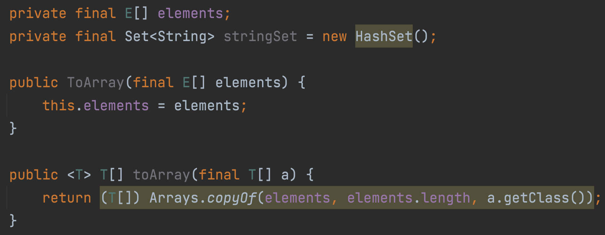

# Item 27: 비검사 경고를 제거하라

## 용어 정리

달달 외워두자

### Type

|영어|한글|예시|
|--:|--:|:--|
| raw type | 로 타입 | `List` |
| parameterized type | 매개변수화 타입 | `List<String>` |
| generic type | 제네릭 타입 | `List<E>` |
| unbounded wildcard type | 비한정적 와일드카드 타입 | `List<?>` |
| bounded wildcard type | 한정적 와일드카드 타입 | `List<? extends Number>` |

### Parameter

|영어|한글|예시|
|--:|--:|:--|
| actual type parameter | 실제 타입 매개변수 | `String` |
| formal type parameter | 정규 타입 매개변수 | `E` |
| bounded type parameter | 한정적 타입 매개변수 | `<E extends Number>` |
| recursive type bound | 재귀적 타입 한정 | `<T extends Comparable<T>>` |

### ETC

|영어|한글|예시|
|--:|--:|:--|
| wildcard | 와일드카드 | `<?>` |
| type token | 타입 토큰 | `String.class` |
| generic method | 제네릭 메서드 | `static <E> List<E> asList(E[] a)` |

## 비검사 경고 예시

```java
import java.util.Arrays;
import java.util.HashSet;
import java.util.Set;

public class ToArray<E> {
    private final E[] elements;
    private final Set<String> stringSet = new HashSet();

    public ToArray(final E[] elements) {
        this.elements = elements;
    }

    public <T> T[] toArray(final T[] a) {
        return (T[]) Arrays.copyOf(elements, elements.length, a.getClass());
    }
}
```

IntelliJ IDE 에서 노란색 박스로 비검사 경고를 표시해준다.



### 해결책

- Type Parameter 명시하기
- 해결하기 귀찮으면 `@SuppressWarnings("unchecked")` 어노테이션 사용하기
  - 단 이럴 때는, 왜 비검사 경고를 무시해도 안전한지 반드시 주석으로 남겨야 한다.
  - 솔직히 무시해도 안전한 경우는 없으니깐 제발 하지 말자.

```java
import java.util.Arrays;
import java.util.HashSet;
import java.util.Set;

public class ToArray<E> {
    private final E[] elements;
    private final Set<String> stringSet = new HashSet<>();

    public ToArray(final E[] elements) {
        this.elements = elements;
    }

    @SuppressWarnings("unchecked")
    public <T> T[] toArray(final T[] a) {
        return (T[]) Arrays.copyOf(elements, elements.length, a.getClass());
    }
}
```

