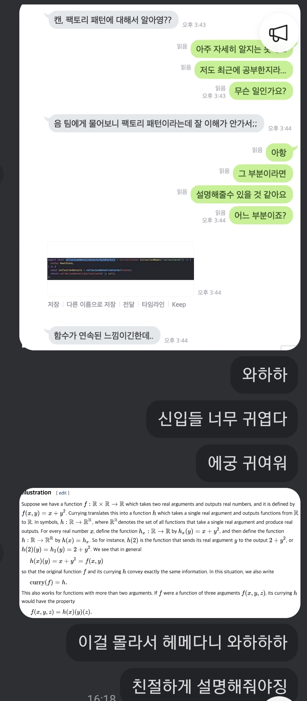

# Item 30: 이왕이면 제네릭 메서드로 만들라

Item30 에 나오는 제네릭 예제들은 객체지향적인 언어 뿐만 아니라, <br>
타입스크립트에서 함수를 설계할 때도 매우 유용한 패턴들이다. <br>
외워두자.

## Raw Type to Generic Method

union1 은  raw type 이라서 노란색으로 warning 이 뜨지만, <br>
union2 는 generic type 을 명시하여, generic method으로 구현해서 warning 이 없다.

```java
import java.util.Arrays;
import java.util.HashSet;
import java.util.Set;

public class Item30 {
    public static Set union1(Set s1, Set s2) {
        Set result = new HashSet(s1);
        result.addAll(s2);
        return result;
    }

    public static <E> Set<E> union2(Set<E> s1, Set<E> s2) {
        Set<E> result = new HashSet<>(s1);
        result.addAll(s2);
        return result;
    }

    public static void main(String[] args) {
        Set<String> guys = setOf("Pyro", "Noel", "Dong");
        Set<String> girls = setOf("Jane", "Yeon", "Woody");

        System.out.println(union1(guys, girls));
        System.out.println(union2(guys, girls));
    }

    public static <E> Set<E> setOf(E ... elements) {
        return new HashSet<>(Arrays.asList(elements));
    }
}
```

## Generic Singleton Factory Pattern

identityFunction 메서드를 제네릭 싱글턴 팩토리 패턴으로 구현해보는 예시이다. <br>
sameString 과 sameNumber 는 분명 다른 타입에 따라 동작하는 함수임에도 불구하고, <br>
indentityFunction 이 새로운 객체를 만들지 않는다.

다만 같은 IDENTITY_FUNCTION 객체를 비검사 형변환하고 있을 뿐이다. <br>
IDENTITY_FUNCTION 이 싱글톤 객체처럼 사용되고 있으므로, 이를 제네릭 싱글턴 팩토리 패턴이라고 한다.

```java
import java.util.function.UnaryOperator;

public class Item30 {
    private static UnaryOperator<Object> IDENTITY_FUNCTION = (t) -> t;

    @SuppressWarnings("unchecked")
    public static <T> UnaryOperator<T> identityFunction() {
        return (UnaryOperator<T>) IDENTITY_FUNCTION;
    }

    public static void main(String[] args) {
        String[] strings = {"One", "Two", "Three"};
        UnaryOperator<String> sameString = identityFunction();
        for (String str: strings) {
            System.out.println(sameString.apply(str));
        }

        Integer[] numbers = { 1, 2, 3 };
        UnaryOperator<Integer> sameNumber = identityFunction();
        for (Integer num: numbers) {
            System.out.println(sameNumber.apply(num));
        }
    }
}
```

본인은 비검사 형변환을 싫어해서, 메모리를 더 사용하더라도 싱글톤을 포기하는 편을 좋아한다. <br>
타입스크립트에서는 커링을 사용해 제네릭 팩토리 패턴을 구현할 수 있다.



## Recursive Type Bound

max 메서드를 재귀적 타입 한정을 활용해 구현해보는 예시이다. <br>
`<E extends Comparable<E>>` 를 통해, max 메서드를 사용하려면 <br>
입력받은 collection 의 원소에 Comparable 이 구현되어 있어야 함을 <br>
컴파일 타임에서 타입체크를 통해 강제할 수 있다.

```java
import java.util.Collection;
import java.util.Objects;

public class Item30 {
    public static <E extends Comparable<E>> E max(Collection<E> collection) {
        if (collection.isEmpty()) {
            throw new IllegalArgumentException("컬렉션이 비어 있습니다.");
        }
        E result = null;
        for (E element: collection) {
            if (result == null || element.compareTo(result) > 0) {
                result = Objects.requireNonNull(element);
            }
        }
        return result;
    }
}
```
